**Continuité du projet [Discogs-Random-Selecta](https://github.com/Ben-TerraPi/Discogs-Random-Selecta)**


Avec le projet ci-dessus, j'ai récupéré, grâce à des requêtes **API**, un fichier regroupant l'intégralité des morceaux de chaque album que je possède et que j'ai répertorié sur [Discogs](https://www.discogs.com/) (l'une des plus grandes bases de données musicales en ligne).

Le tableau :
| album_id  | artist | album | track_id | title | 
|-----------|--------|-------|----------|-------|

Le fichier : [my_tracks.csv](https://github.com/Ben-TerraPi/Discogs-Random-Selecta/blob/main/my_tracks.csv) avec **5347** tracks.

Maintenant, le but est de regrouper par cluster l'ensemble de ces morceaux en utilisant leurs caractéristiques audio. Pour cela, je vais directement récupérer celles déjà existantes et créées par Spotify en utilisant son **API** avec [Spotipy](https://spotipy.readthedocs.io/en/2.25.1/). 

Peut-être qu'ultérieurement, j'analyserai moi-même mes fichiers audio dans un autre projet avec les bibliothèques Python [Librosa](https://librosa.org/doc/latest/index.html#) et [Essentia](https://essentia.upf.edu/index.html#).

# Dossier [Spotify](https://github.com/Ben-TerraPi/clustering_with_audio_feature/tree/main/spotify)

## Fichier [spotify_id.py](https://github.com/Ben-TerraPi/clustering_with_audio_feature/blob/main/spotify/spotify_id.py)

Après l'activation de mes identifiants développeur Spotify pour l'authentification via l'**API**, je vais requêter la base de données pour recouper mon tableau avec les morceaux disponibles sur Spotify afin de récupérer leur ID. Pour cela je vais utiliser le nom de l'artiste, le titre et l'album du morceau.

À la suite de mes tests, je réalise qu'il faut rechercher des correspondances en plusieurs étapes pour s'assurer de la qualité des données.

- nettoyage
- étape 1: correspondance exacte artist-titre
- étape 2: correspondance exacte titre-album
- étape 3: Correspondance exacte artiste-titre-album
- étape 4: fuzzy match artiste-titre-album
- étape 5: fuzzy match titre-album
- étape 6: fuzzy match artiste-titre
- étape 7: code de départ moins précis qui récupère seulement si artiste "AND" titre sont présent (au cas où..)

7 fonctions regroupées dans une:

```
def get_track_id(artist, track, album):

    track_id = get_track_id_by_artist(artist, track)
    if track_id:
        return track_id
    track_id = get_track_id_by_album(track, album)
    if track_id:
        return track_id
    track_id = get_track_id_by_artist_album(artist, track, album)
    if track_id:
        return track_id
    track_id = get_track_id_fuzzy(artist, track, album)
    if track_id:
        return track_id
    track_id = get_track_id_fuzzy_track_album(track, album)
    if track_id:
        return track_id
    track_id = get_track_id_fuzzy_artist_track(artist, track)
    if track_id:
        return track_id
    return get_title_artist_id(artist, track)
```

Cette dernière est appelée lors de la création du nouveau tableau [my_tracks_spotify_id.csv](https://github.com/Ben-TerraPi/clustering_with_audio_feature/blob/main/spotify/my_tracks_spotify_id.csv):

```
def add_id_to_csv(input_file_path, output_file_path, limit=None):
    df = pd.read_csv(input_file_path)
    print("Récupération des spotify_id")

    if limit:
        df = df.head(limit)

    tqdm.pandas()
    df['spotify_id'] = df.progress_apply(lambda row: get_track_id(row['artist'], row['title'], row['album']), axis=1)

    df.to_csv(output_file_path, index=False)
    print(f"Les IDs Spotify ont été ajoutés et sauvegardés dans {output_file_path}")
```

Sur les 5347 morceaux:
- **4113** spotify_id uniques récupérés: [my_tracks_with_spotify_id.csv](https://github.com/Ben-TerraPi/clustering_with_audio_feature/blob/main/spotify/my_tracks_with_spotify_id.csv)
- 149 doublons
- 1085 morceaux non identifiés: [my_tracks_without_spotify_id.csv](https://github.com/Ben-TerraPi/clustering_with_audio_feature/blob/main/spotify/my_tracks_without_spotify_id.csv)
(ils représentent, pour un pourcentage élevé, les titres venant de compilations où le nom de l'artiste est appelé "Various")


## Fichier [audio_features.py](https://github.com/Ben-TerraPi/clustering_with_audio_feature/blob/main/spotify/audio_features.py)

Je suis resté bloqué sur cette étape avant de comprendre que Spotify avait fait le choix de bloquer l'attribut **.audio_features** (erreur 403) depuis le mois de novembre 2024, ne permettant plus de récupérer les données correspondantes. 
N.B. : Je garde mon code dans le cas d'un retour de la fonctionnalité.

### Alternative pour la récupération des features audio avec le site [Exportify](https://exportify.net/)

Malgré la fermeture de l'accès par Spotify à certaines fonctionnalités de l'API, il existe encore des sites qui fournissent les données souhaitées. Pour cela, il est nécessaire de créer une playlist Spotify afin de pouvoir l'exporter vers le site en question.

## Fichier [export_playlist.py](https://github.com/Ben-TerraPi/clustering_with_audio_feature/blob/main/spotify/export_playlist.py)

Fonction pour l'exportation de mes morceaux vers spotify grâce à leur ID:

```
def create_spotify_playlist(csv_file_path, sp, playlist_name, cluster=None):

    df = pd.read_csv(csv_file_path)

    # après ML
    if cluster is not None:
        df = df[df['Cluster'] == cluster]

    track_ids = df['spotify_id'].tolist()

    # créer playlist
    user_id = sp.me()['id']
    playlist = sp.user_playlist_create(user_id, name = playlist_name, public=True)
    playlist_id = playlist['id']

    for i in tqdm(range(0, len(track_ids), 100), desc="morceaux >> playlist"):
        sp.playlist_add_items(playlist_id, track_ids[i:i+100])

    print(f"créée avec succès : {playlist['external_urls']['spotify']}")
```

Avec `create_spotify_playlist("spotify/my_tracks_spotify_ids.csv", sp, 'Ma nouvelle playlist')` ma [playlist](https://open.spotify.com/playlist/3XjEseEzqCk5wmensDKdfd) est accessible et téléchargeable en **.csv** via **Exportify** pour récupérer les caractéristiques audio des morceaux.

# Etape de travail BigQuery

Une fois le fichier récupéré, j'utilise un de mes projets sur **BigQuery** pour les prochaines étapes :

- Vérification de clé primaire
- Fusion de différents tableaux
- Mise en forme du tableau final

Pour rappel, mon premier tableau ressemble à cela après récupération des ID spotify:
| album_id  | artist | album | track_id | title |spotify_id |
|-----------|--------|-------|----------|-------|-----------|

## Primary key
```
#TEST PRIMARY KEY
SELECT
spotify_id, #track_id
COUNT(*) AS nb
FROM `my_data.my_tracks_with_spotify_id`
GROUP BY
spotify_id #track_id
HAVING nb>=2
ORDER BY nb DESC
```
**spotify_id** et **track_id** représente bien des valeurs uniques chacune.

## Left join

Je récupère les infos de **genre** et **style** avec à un autre tableau:
```
SELECT m.spotify_id,
m.album,
m.artist,
m.track_id,
m.title,
c.genre,
c.style
FROM discogs-random-selecta.my_data.my_tracks_with_spotify_id as m
LEFT JOIN discogs-random-selecta.my_data.collection_clean as c
ON m.album_id = c.id
```

| spotify_id | album | artist | track_id | title | genre | style |
|------------|-------|--------|----------|-------|-------|-------|

Ensuite y ajoute mes données **Exportify** avec une vue intermédiaire avant création de la table final

```
#CREATION final_v1
SELECT
g.*,
l.* EXCEPT(track_id)
FROM `my_data.left_join_genre_id`as g
LEFT JOIN discogs-random-selecta.export_spotify.4113_join as l
ON g.spotify_id = l.Track_Id
```

Après avoir renommé et selectioné l'ordre des colonnes mon tableau ressemble à cela:

| Track_id | Artist | Title |Album | Genre | Style | Popularity | Danceability | Energy | Loudness | Speechiness | Acousticness | Instrumentalness | Liveness | Valence | Tempo | Time_Signature | Time | Key | Camelot | Spotify_key| Spotify_mode | spotify_id |
|----------|--------|-------|------|-------|-------|------------|--------------|--------|----------|-------------|--------------|------------------|----------|---------|-------|----------------|------|-----|---------|------------|--------------|------------|

# Dossier [ML](https://github.com/Ben-TerraPi/clustering_with_audio_feature/tree/main/ML)

## Fichier [tracks_features.csv](https://github.com/Ben-TerraPi/clustering_with_audio_feature/blob/main/ML/tracks_features.csv)

Tableau final importé depuis **BigQuery**.

Pour information, la signification des caractéristiques audio récupérés sont toujours visible sur le [site développeur Spotify](https://developer.spotify.com/documentation/web-api/reference/get-audio-features)

## Fichier [ml_clustering.py](https://github.com/Ben-TerraPi/clustering_with_audio_feature/blob/main/ML/ml_clustering.py)

Le travail de regroupement par cluster de **4113** sur **547** morceaux de ma collection personnelles en vinyls peut enfin commencé. 

Pour cela j'utilise la librairie de Machine Learning [scikit-learn](https://scikit-learn.org/stable/index.html) avec KMeans.

### Analyse des données

`tracks_features = pd.read_csv(r"C:\Users\benoi\code\Ben-TerraPi\clustering_with_audio_feature\ML\tracks_features.csv")`

<table>
  <tr>
    <td width="50%" valign="top">
      <pre><code>
spotify_num = tracks_features.select_dtypes(include=['int64', 'float64'])

plt.figure(figsize=(12, 10))
sns.heatmap(spotify_num.corr(), annot=True, fmt=".2f", cmap='coolwarm')
plt.title("Correlation Heatmap of Spotify Song Attributes")
plt.show()
      </code></pre>
      Par rapport au graphique de corrélation et mes besoins, les paramètres sélectionnés sont :
      <ul>
        <li>Danceability</li>
        <li>Energy</li>
        <li>Loudness</li>
        <li>Instrumentalness</li>
        <li>Valence</li>
        <li>Tempo</li>
      </ul>
    </td>
    <td width="50%" valign="top">
      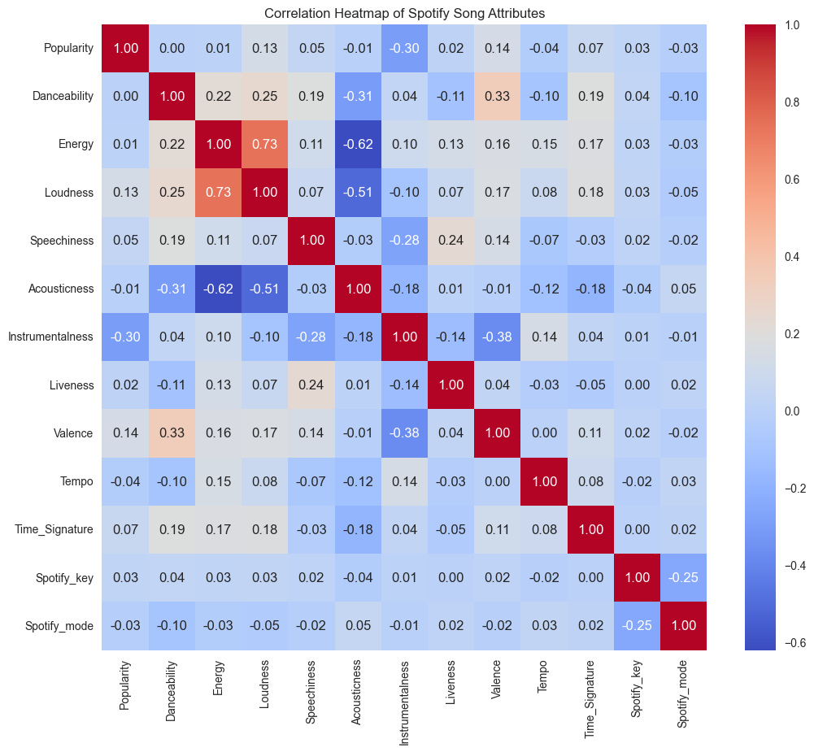
    </td>
  </tr>
</table>

### Preprocessing avec Robustscaler

```
spotify_numeric = spotify_num[["Danceability", "Energy", "Loudness", "Instrumentalness", "Valence",	"Tempo"]].dropna()

scaler = RobustScaler()
spotify_scaled = pd.DataFrame(scaler.fit_transform(spotify_numeric),
                              columns=spotify_numeric.columns)
```

### Recherche de valeur de k pour KMeans

```
nb_clusters_to_try = np.arange(1, 21, 1)
nb_clusters_to_try

inertias = []

for k in nb_clusters_to_try:
    kmeans = KMeans(n_clusters=k, n_init='auto', random_state=42)
    kmeans.fit(spotify_scaled)
    inertias.append(kmeans.inertia_)
```

<table>
  <tr>
    <td width="50%" valign="top">
      <pre><code>
fig = px.line(y=inertias,
              x=range(1, len(inertias) + 1),
              labels={'x': 'nb centroids', 'y':'Inertia'},
              title="Elbow method")
fig.show()
      </code></pre>
      Selon la graphique d'Elbow Method, la valeur de k est estimé à 8
        <pre><code>
      spotify_clusters = 8
        </code></pre>
    </td>
    <td width="50%" valign="top">
      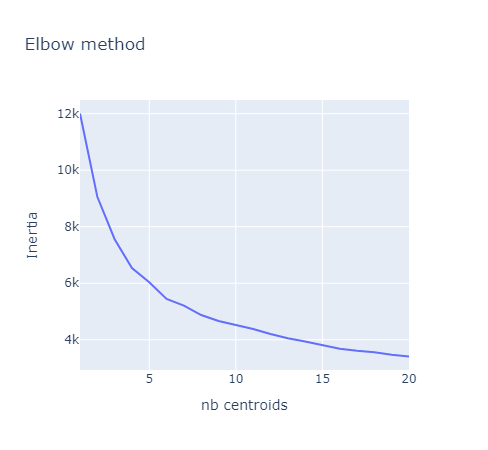
    </td>
  </tr>
</table>


### KMeans clustering
```
kmeans = KMeans(n_clusters=spotify_clusters, n_init='auto', random_state=42)
kmeans.fit(spotify_scaled)

# labels des clusters

labelling = kmeans.labels_

# score 

silhouette_score(spotify_scaled, labelling)
```

### 3D plot

<table>
  <tr>
    <td width="50%" valign="top">
      <pre><code>
fig_scaled = px.scatter_3d(spotify_scaled,
       x='Danceability',
       y='Energy',
       z='Valence',
       color=labelling,
       width=500,
       height=500)
          
fig_scaled.show()
      </code></pre>
      Avec 3 paramètres sélectionnés sur 6, nous pouvons voir les clusters formés.
    </td>
    <td width="50%" valign="top">
      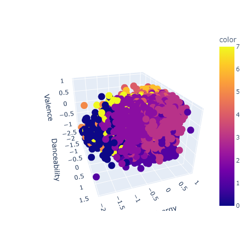
    </td>
  </tr>
</table>

### Heatmap des centroïdes

<table>
  <tr>
    <td width="50%" valign="top">
      <pre><code>
cluster_centers = kmeans.cluster_centers_

#%% DF pour les centroïdes

centroids_df = pd.DataFrame(cluster_centers, columns=spotify_scaled.columns)

#%% heatmap centroïdes

plt.figure(figsize=(12, 8))
sns.heatmap(centroids_df, annot=True, cmap='coolwarm', linewidths=0.5)
plt.title('Heatmap des centroïdes des clusters (K-Means)')

plt.show()
      </code></pre>
      Ce graphique va permettre d'analyser les correspondences pour nommer les clusters.
    </td>
    <td width="50%" valign="top">
      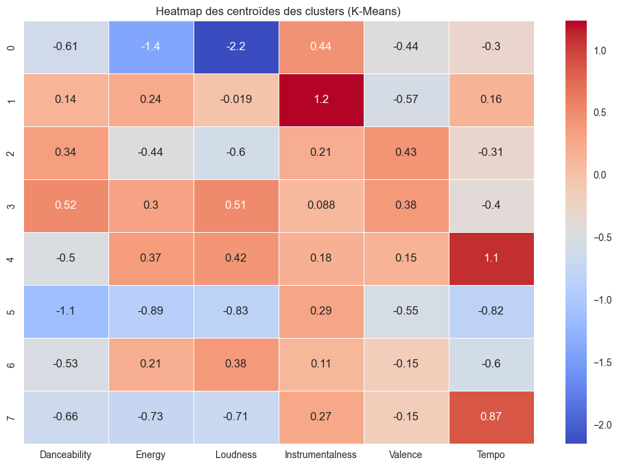
    </td>
  </tr>
</table>


### Analyse de la heatmap avec Mistral AI

- Cluster 0 : "Morceaux Calmes et Peu Énergiques" - Faible danceabilité, énergie, et loudness.
- Cluster 1 : "Morceaux Instrumentaux et Acoustiques" - Forte instrumentalité et acoustique modérée.
- Cluster 2 : "Morceaux Équilibrés" - Caractéristiques modérées, légèrement positives en danceabilité et énergie.
- Cluster 3 : "Morceaux Positifs et Énergiques" - Valence élevée, danceabilité et énergie modérées.
- Cluster 4 : "Morceaux Rapides et Instrumentaux" - Tempo élevé, instrumentalité modérée.
- Cluster 5 : "Morceaux Doux et Calmes" - Faible énergie, loudness, et valence.
- Cluster 6 : "Morceaux Modérés" - Caractéristiques modérées, légèrement positives en danceabilité et énergie.
- Cluster 7 : "Morceaux Rapides et Énergiques" - Tempo élevé, énergie modérée.

### Résultats et création des playlists

Nombre de morceaux par cluster:

`np.unique(labelling,return_counts=True)` = (array([0, 1, 2, 3, 4, 5, 6, 7], dtype=int32),
 array([238, 794, 644, 810, 508, 291, 493, 330]))

Nouveau fichier .csv:
```
tracks_features['Cluster'] = pd.Series(labelling)

tracks_features.to_csv(r"C:\Users\benoi\code\Ben-TerraPi\clustering_with_audio_feature\ML\spotify_ML_clusters.csv", index= False)
```
Export vers **BigQuery**:
```
project_id = "discogs-random-selecta"
table_id = "discogs-random-selecta.ML.spotify_ML_clusters"

pandas_gbq.to_gbq(tracks_features, table_id , project_id)
```

Test des 8 clusters avec 5 morceaux par playlists
```
daily_mixes = {}

for num_cluster in np.unique(labelling):

  daily_mixes[num_cluster] = tracks_features[tracks_features['Cluster'] == num_cluster]

for key,value in daily_mixes.items():
  print("-" * 50)
  print(f"playlist {key}")
  print("-" * 50)
  display(value.sample(5)[['Title', 'Artist', "Album", "Genre", "Style"]])
```

<table>
  <tr>
    <td>
      <figure>
        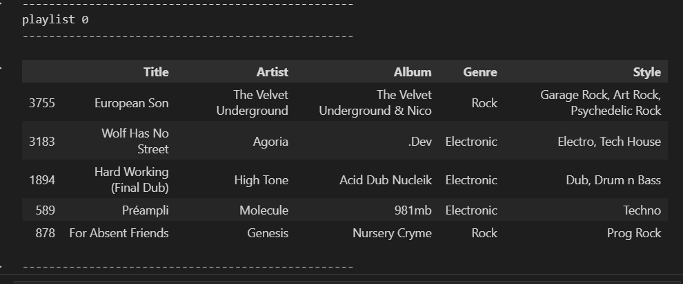
        <figcaption>"Morceaux Calmes et Peu Énergiques"</figcaption>
      </figure>
    </td>
    <td>
      <figure>
        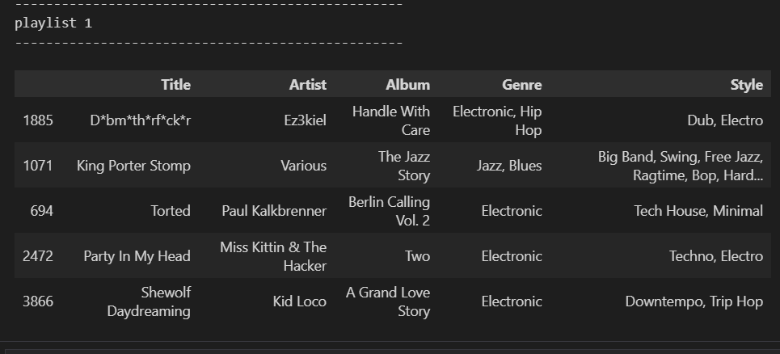
        <figcaption>"Morceaux Instrumentaux et Acoustiques"</figcaption>
      </figure>
    </td>
  </tr>
  <tr>
    <td>
      <figure>
        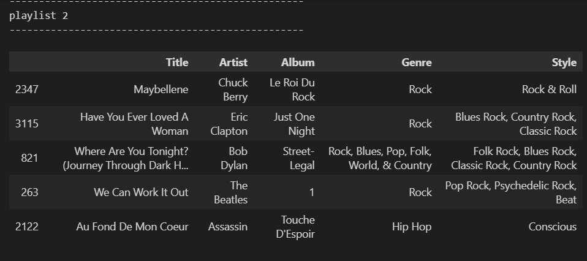
        <figcaption>"Morceaux Équilibrés"</figcaption>
      </figure>
    </td>
    <td>
      <figure>
        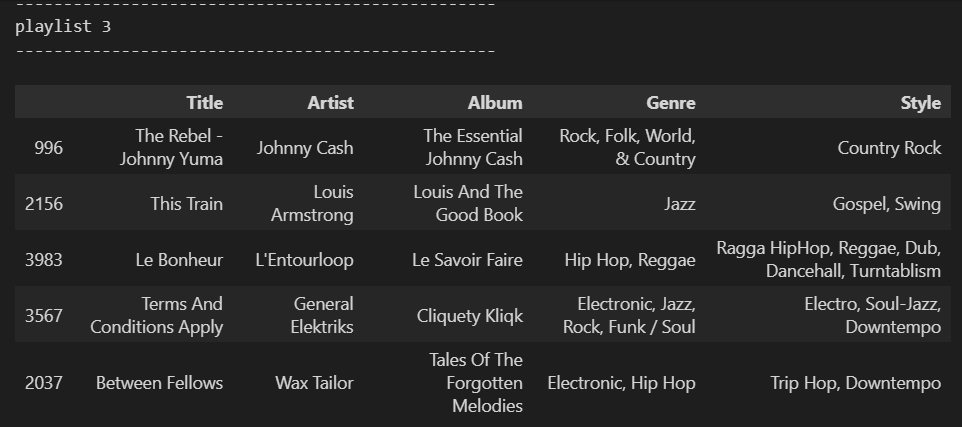
        <figcaption>"Morceaux Positifs et Énergiques"</figcaption>
      </figure>
    </td>
  </tr>
  <tr>
    <td>
      <figure>
        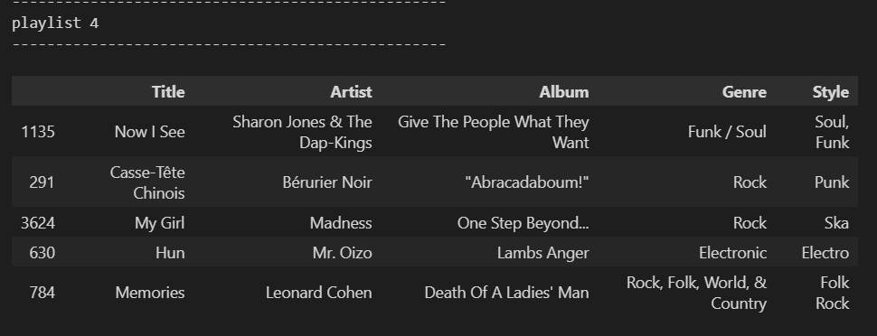
        <figcaption>"Morceaux Rapides et Instrumentaux"</figcaption>
      </figure>
    </td>
    <td>
      <figure>
        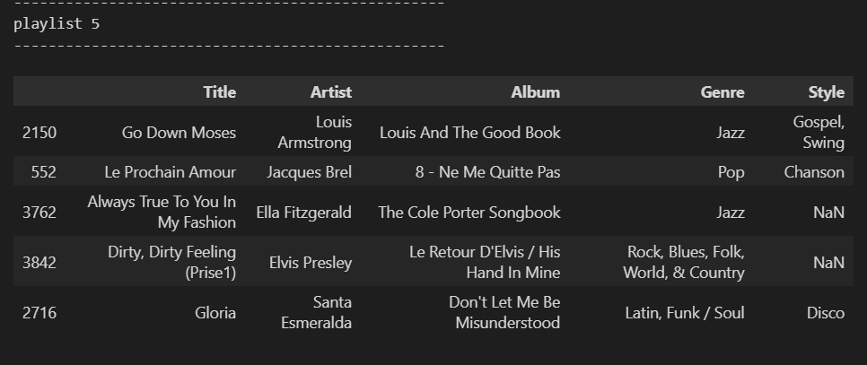
        <figcaption>"Morceaux Doux et Calmes"</figcaption>
      </figure>
    </td>
  </tr>
  <tr>
    <td>
      <figure>
        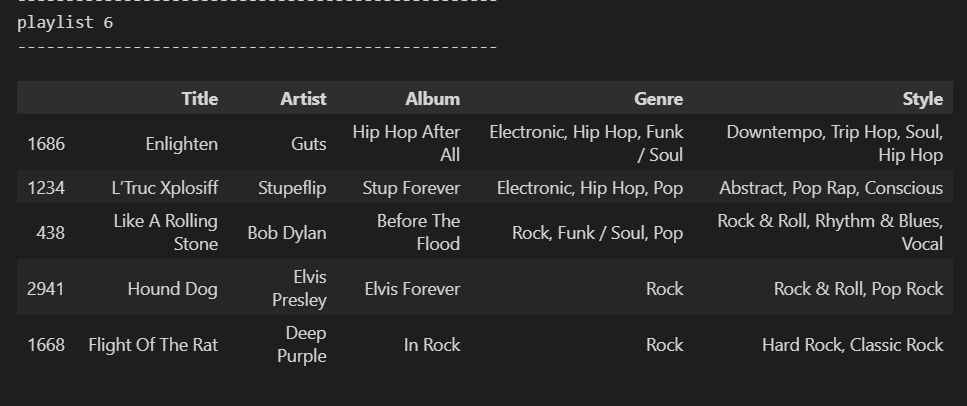
        <figcaption>"Morceaux Modérés"</figcaption>
      </figure>
    </td>
    <td>
      <figure>
        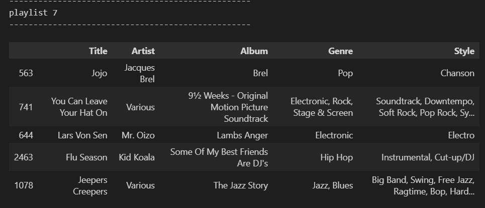
        <figcaption>"Morceaux Rapides et Énergiques"</figcaption>
      </figure>
    </td>
  </tr>
</table>

# Transfert vers Spotify

Fichier [export_playlist.py](https://github.com/Ben-TerraPi/clustering_with_audio_feature/blob/main/spotify/export_playlist.py)

Quitte à avoir déjà utilisé ce code et créé de nouvelles playlists autant en profité en les uploadant vers Spotify!

```
create_spotify_playlist("ML/spotify_ML_clusters.csv", sp, "Calmes", cluster = 0)
create_spotify_playlist("ML/spotify_ML_clusters.csv", sp, "Instrumentaux", cluster = 1)
create_spotify_playlist("ML/spotify_ML_clusters.csv", sp, "Équilibrés", cluster = 2)
create_spotify_playlist("ML/spotify_ML_clusters.csv", sp, "Positifs et Énergiques", cluster = 3)
create_spotify_playlist("ML/spotify_ML_clusters.csv", sp, "Rapides et Instrumentaux", cluster = 4)
create_spotify_playlist("ML/spotify_ML_clusters.csv", sp, "Doux et Calmes", cluster = 5)
create_spotify_playlist("ML/spotify_ML_clusters.csv", sp, "Modérés", cluster = 6)
create_spotify_playlist("ML/spotify_ML_clusters.csv", sp, "Rapides et Énergiques", cluster = 7)
```

Ces playlists sont maintenant retrouvables [ici](https://open.spotify.com/user/31ktx7bt2iijuup5jfuqbzbibdqa/playlists).


# Conclusion

! ... A venir après écoute et vérifications de la cohérance des résultats... !

